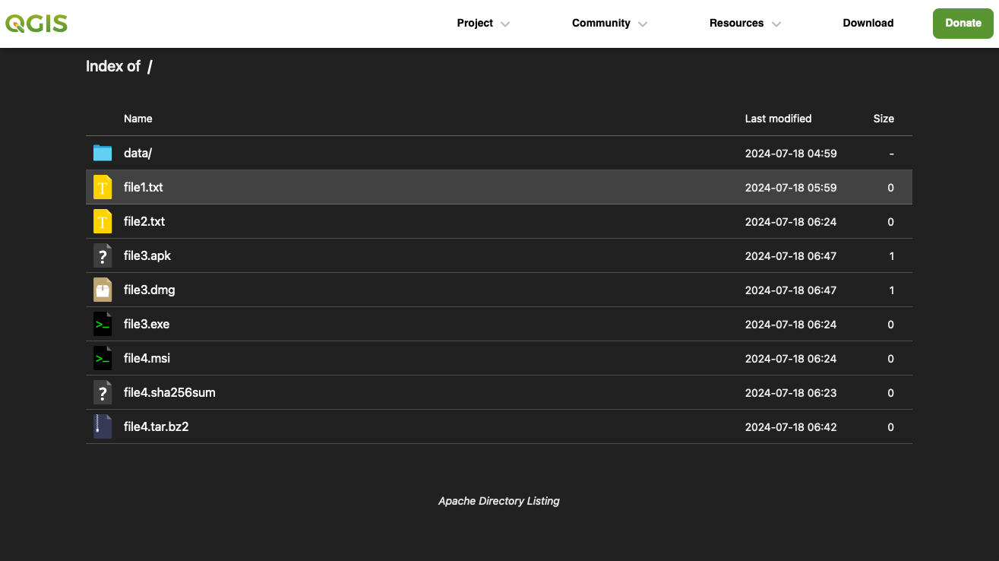

# QGIS Apache-Directory-Listing

> A directory listing theme for Apache

'Apache Directory Listing' is a directory listing theme based on this repo: https://github.com/ramlmn/Apache-Directory-Listing.

### Themes

|        `dark-mode`       |        `light-mode`        |
|:----------------------------:|:------------------------------:|
|  |  |

## Usage

1. Download or clone the repo and copy `directory-listing` directory to the root directory of your Apache Server (ex: `/var/www/html/`).
2. Copy `html/.htaccess` file to the root directory of your server (ex: `/var/www/html/`).

## Credits

* Copyright (c) Ram Lmn <ramlmn@outlook.com>

## License
[MIT](license.txt)
